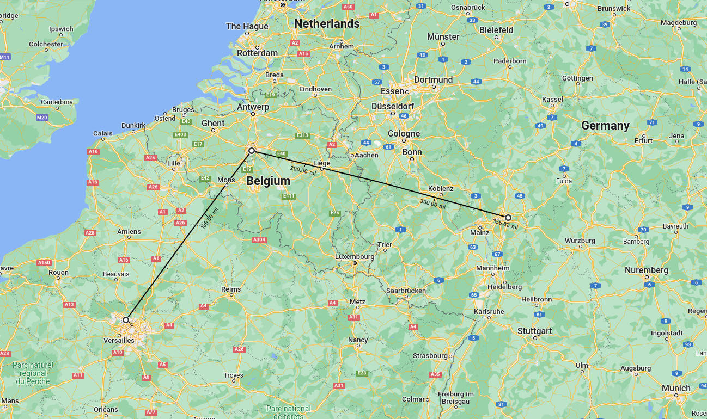

# Coordinates

A CLI tool to get distance (km) between multiple coordinates
  
|Linux|Windows  |
|--|--|
|./coordinates | coordinates.exe |

## 1. Algorithm used
[Haversine formula](https://en.wikipedia.org/wiki/Haversine_formula)

## 2. Usage

    Gets the distance (Km) between multiple coordinates using Haversine formula

    USAGE:
        coordinates --coordinates <LATITUDE,LONGITUDE>

    OPTIONS:
        -c, --coordinates <LATITUDE,LONGITUDE>    Comma-separated latitudes and longitudes
        -h, --help                                Print help information
        -V, --version                             Print version information
        

## 3. Example


| Place | Latitude| Longitude  |
|--|--|--|
| Paris | 48.96817 | 2.34246 |
| Bruxels | 50.49890 | 4.71467 |
| Frankfurt | 50.29843 | 8.42832|




```sh
./coordinates -c 48.96817,2.34246,50.49890,4.71467,50.29843,8.42832
```

```sh
505.03
```
> Coordinates' ranges :warning:
>
> -90 <= latitude <= 90
>
> -180 <= longitude <= 180
